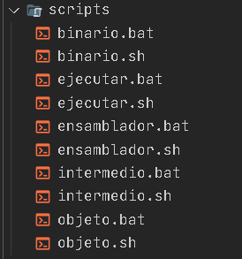
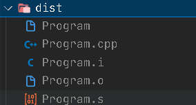
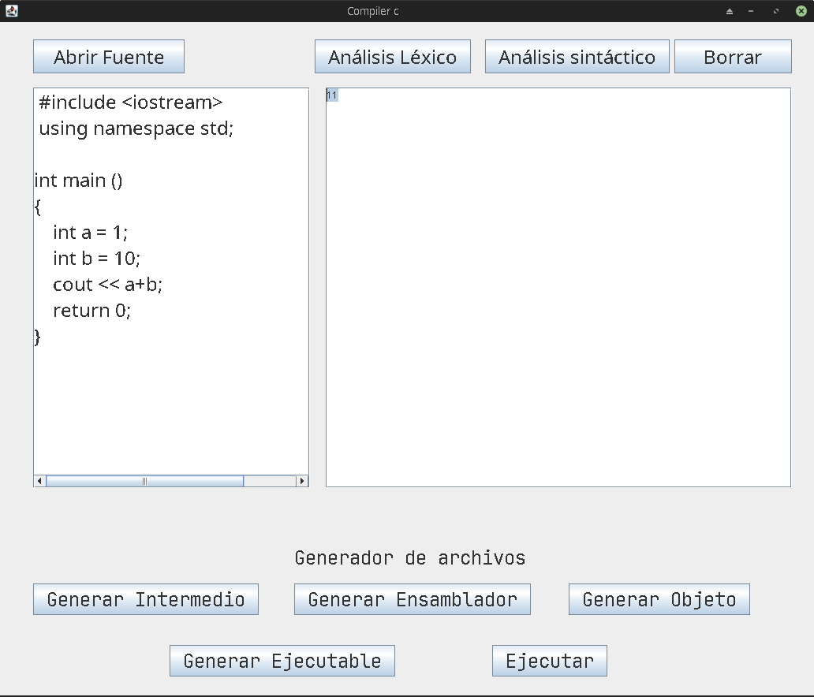

# Analizador de léxico

Proyecto sobre analizadores de léxico y sintaxis en java mediante las librerias de Jcup y Jflex

## Autores

- Miguel Ángel Rico García - **20191020107**
- Sergio David Paez Suarez - **20191020167**

## Cambios en los archivos

Los principales cambios que se realizaron sobre el proyecto original de UDIN fueron:

<br>

`Modificación del regex para el manejo de números sean negativos,decimales o que cumpla ambas condicones`
```
("(-"{D}+")")|({D}+"."+{D})|("(-"{D}+"."+{D}+")")|{D}+|("-"+{D}+"."+{D})|("-"+{D}) {lexemas=yytext(); return Numero;}
```
`Separación de la agrupación para los tipos de datos que se manejen de las variables`
``` 
/* Tipos de datos */ 
(byte) {lexemas=yytext(); return Byte;}
(int)  {lexemas=yytext(); return Int;}
(char) {lexemas=yytext(); return Char;}
(short) {lexemas=yytext(); return Short;}
(long) {lexemas=yytext(); return Long}
(float) {lexemas=yytext(); return Float;}
(double) {lexemas=yytext(); return Double;}
(String) {lexemas=yytext(); return Cadena;}
```

`Se agregarón más tokens para el manejo del analizador lexico, principalmente los expuestos en la plataforma.`

```
Tipos de dato nativos */
(#include) {lexemas=yytext(); return Include}
(define) {lexemas=yytext(); return Define;}
(break) {lexemas=yytext(); return Break;}
(const) {lexemas=yytext(); return Const;}
(continue) {lexemas=yytext(); return Continue;}
(default) {lexemas=yytext(); return Default;}
(register) {lexemas=yytext(); return Register;}
(unsigned) {lexemas=yytext(); return Unsigned;}
(struct) {lexemas=yytext(); return Struct;}
(switch) {lexemas=yytext(); return Switch;}
(case) {lexemas=yytext(); return Case;}
(typedef) {lexemas=yytext(); return Typedef;}

/* Tipos de dato funciones*/
( printf ) {lexemas=yytext(); return Printf;}
( scanf ) {lexemas=yytext(); return Scanf;}
( cin ) {lexemas=yytext(); return Cin;}
( cout ) {lexemas=yytext(); return Cout;}
( using ) {lexemas=yytext(); return Using;}
( namespace ) {lexemas=yytext(); return Namespace;}
( std ) {lexemas=yytext(); return Std;}
( void ) {lexemas=yytext(); return Void;}
```
`Tambien se Hizo la separación de los Operadores Logicos,Númericos y de Asignación`
```
/* Operador Igual */
("=") {lexemas=yytext(); return Asignation;}
/* Operador Suma */
("+") {lexemas=yytext(); return Add;}
/* Operador Resta */
("-") {lexemas=yytext(); return Resta;}
/* Operador Multiplicacion */
("*") {lexemas=yytext(); return Times;}
/* Operador Division */
("/") {lexemas=yytext(); return Divide;}
/* Operador Modulo */
("%") {lexemas=yytext(); return Module;}

/* Operadores logicos */
(true) {lexemas=yytext(); return True;}
(false) {lexemas=yytext(); return False;}
("&&") {lexemas=yytext(); return DoubleAnd;}
("||") {lexemas=yytext(); return DoubleOr;}
("!") {lexemas=yytext(); return Not;}
("&") {lexemas=yytext(); return And;}
("|") {lexemas=yytext(); return Or;}

/*Operadores Relacionales */
(">") {lexemas = yytext(); return GreatherThan;}
("<") {lexemas = yytext(); return LessThan;}
("==") {lexemas = yytext(); return Equal;}
("!=") {lexemas = yytext(); return NotEqual;}
(">=") {lexemas = yytext(); return GreaterEqualThan;}
("<=") {lexemas = yytext(); return LessEqualThan;}
("<<") {lexemas = yytext(); return LeftShift;}
(">>") {lexemas = yytext(); return RightShift;}

/* Operadores Atribucion */
("+=") {lexemas = yytext(); return PlusEqual;}
("++") {lexemas = yytext(); return Increment;}
("--") {lexemas = yytext(); return Decrement;}
("-=") {lexemas = yytext(); return MinusEqual;}
("*=") {lexemas = yytext(); return TimesEqual;}
("/=") {lexemas = yytext(); return DivideEqual;}
("%=") {lexemas = yytext(); return ModuleEqual;}
```

# Analizador de Sintaxis

## Cambios en los archivos
Los principales cambios que se realizaron sobre el proyecto fuerón

- Agregando un token más para el analizador lexico

```
( "," ) {lexemas=yytext(); return Coma;}
```

Ademas de eso para el archivo `Sintaxix.cup` se modifico lo siguiente:

`Definición de elementos terminales`
```
terminal Int, Byte, Char, Short, Long, Float,Double,       Cadena,Linea, Comillas,
        Include, Define, Break, Const, Continue, Default, Register, Unsigned, Struct,
        Switch, Case,
        Typedef,
        Printf, Scanf, Cin, Cout, Using, Namespace, Std, Void,
        If, Else, Do, While, For,
        Asignation, Add, Resta, Times, Divide, Module,
        DoubleAnd, DoubleOr, Not, And, Or, GreatherThan, LessThan, Equal, NotEqual, GreaterEqualThan, LessEqualThan,
        LeftShift, RightShift, PlusEqual, Increment, Decrement, MinusEqual, TimesEqual, DivideEqual, ModuleEqual,
        True, False,
        Parent_a, Parent_c, Llave_a, Llave_c, Corchete_a, Corchete_c,
        Main, P_coma, Dos_P, Punto, Coma, Identificador, Numero, ERROR;
```

`Definición de elementos no terminales`

```
non terminal INICIO, SENTENCIA, T_DATO, OPERADOR,OPERADOR_LOGICO,OPERADOR_RELACIONAL, OPERADOR_CORRIMIENTO, OPERADOR_ATRIBUCION,OPERADOR_UNARIO, DECLARACION, DECLARACION_FOR,SENTENCIA_BOOLEANA, IF, IF_ELSE, FOR, DO_WHILE, SWITCH_CASE, SWITCH, WHILE, PRINTF;
```

`Definición del punto de entrada del codigo a analizar`

```
INICIO ::= 
    Int Main Parent_a Parent_c Llave_a SENTENCIA Llave_c |
    Main Parent_a Parent_c Llave_a SENTENCIA Llave_c
;
```

`Definición de un sentencia`
```
SENTENCIA ::= 
    SENTENCIA DECLARACION |
    DECLARACION |
    SENTENCIA IF | 
    IF |
    SENTENCIA IF_ELSE |
    IF_ELSE |
    SENTENCIA FOR |
    FOR |
    SENTENCIA DO_WHILE |
    DO_WHILE |
    SENTENCIA SWITCH |
    SWITCH |
    SENTENCIA WHILE |
    WHILE |
    SENTENCIA PRINTF |
    PRINTF;
```

`Definición para el tipo de dato de una variable`

```
T_DATO ::=
    Int | Byte | Char | Short | Long | Float | Double | Cadena
;
```

`Definición de los operadores`
```
OPERADOR ::=
    Asignation | Add | Resta | Times | Divide | Module
;

OPERADOR_LOGICO ::=
    DoubleAnd | DoubleOr | Not | And | Or
;

OPERADOR_RELACIONAL ::=
    GreatherThan | LessThan | Equal | NotEqual | GreaterEqualThan | LessEqualThan
;

OPERADOR_CORRIMIENTO ::=
    LeftShift | RightShift
;

OPERADOR_ATRIBUCION ::=
    PlusEqual | MinusEqual | TimesEqual | DivideEqual | ModuleEqual
;

OPERADOR_UNARIO ::=
    Increment | Decrement
;
```

`Decalaración de una variable`
```
DECLARACION ::=
    Identificador OPERADOR_UNARIO |
    Identificador OPERADOR_UNARIO P_coma |
    Identificador OPERADOR_ATRIBUCION Numero P_coma |
    Identificador OPERADOR_ATRIBUCION Identificador P_coma |
    Identificador Asignation Numero P_coma |
    Identificador Asignation Identificador P_coma |
    Identificador Asignation Comillas Comillas P_coma |
    Identificador Asignation Comillas Identificador Comillas P_coma |
    T_DATO Identificador OPERADOR_ATRIBUCION Numero P_coma |
    T_DATO Identificador OPERADOR_ATRIBUCION Identificador P_coma |
    T_DATO Identificador P_coma |
    T_DATO Identificador Asignation Numero P_coma |
    T_DATO Identificador Asignation Identificador P_coma |
    T_DATO Identificador Asignation Comillas Comillas P_coma |
    T_DATO Identificador Asignation Comillas Identificador Comillas P_coma
;
```

`Ciclos y sentencias booleanas`

```
SENTENCIA_BOOLEANA ::=
    True |
    False |
    Identificador OPERADOR_RELACIONAL Comillas Comillas |
    Identificador OPERADOR_RELACIONAL Comillas Identificador Comillas |
    Identificador OPERADOR_RELACIONAL Identificador |
    Identificador OPERADOR_RELACIONAL Numero |
    Numero OPERADOR_RELACIONAL Identificador |
    Numero OPERADOR_RELACIONAL Numero
;

IF ::= 
    If Parent_a SENTENCIA_BOOLEANA Parent_c Llave_a SENTENCIA Llave_c
;

IF_ELSE ::=
    IF Else Llave_a SENTENCIA Llave_c
;

FOR ::=
    For Parent_a DECLARACION_FOR P_coma SENTENCIA_BOOLEANA P_coma DECLARACION Parent_c Llave_a SENTENCIA Llave_c
;

DO_WHILE ::=
    Do Llave_a SENTENCIA Llave_c While Parent_a SENTENCIA_BOOLEANA Parent_c P_coma
;

SWITCH_CASE ::=
    Case Identificador Dos_P SENTENCIA |
    Case Identificador Dos_P SENTENCIA SWITCH_CASE
;

SWITCH ::=
    Switch Parent_a Identificador Parent_c Llave_a SWITCH_CASE Default Dos_P SENTENCIA Llave_c
;

WHILE ::=
    While Parent_a SENTENCIA_BOOLEANA Parent_c Llave_a SENTENCIA Llave_c
;

PRINTF ::=
    Printf Parent_a Identificador Parent_c P_coma |
    Printf Parent_a Comillas Identificador Comillas Parent_c P_coma
;
```

# Cambios finales del proyecto
## Creación de archivos

Para esta ultima parte del proyecto se agregarón los ejecutables `.sh` o `.bat` (dependiendo de si se esta trabajando en linux o windows) para generar los distintos archivos que usa un compilador a la hora de generar el ejecutable

<br>

> **Nota**: `Es necesario concatenar a la varibale` **PATH** del sistema la ruta de algun compilador de c++` como lo puede ser mingw

<br>



Y ya usandolos a nivel del codigo generamos la siguiente salida en un carpeta llamada `dist`



Ademas de eso se agrego en el codigo los botones para las llamadas de cada uno de los scripts, asi como el resultado de la ejecución del codigo.

